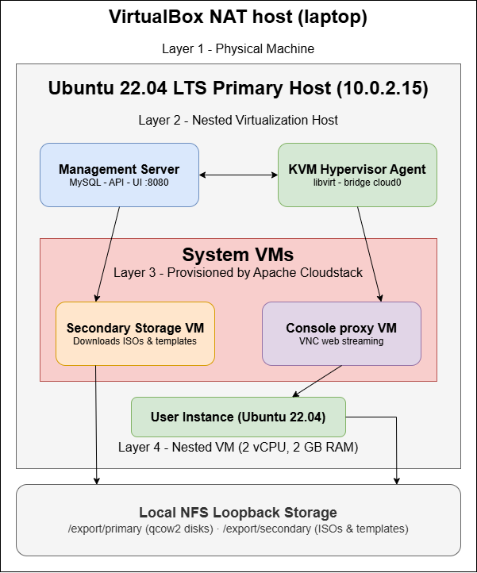

# Final Project Cloud Computing Infrastructure: Nested Virtualization on VirtualBox

## Group 2: 
- Aisya Rivelia Azzahra (2306161864)
- Calvin Wirathama Katoroy (2306242395)
- Ganendra Garda Pratama (2306250642)
- Ibnu Zaky Fauzi (2306161870)
- Jonathan Frederick Kosasih (2306225981)
- Mirza Adi Raffiansyah (2306210323)
- Muhamad Dzaky Maulana (2306264401)
- Naufal Hadi Rasikhin (2306231366)
- Teufik Ali Hadzalic (2306267012)
- Wesley Frederick Oh (2306202763)

| Architecture Layer | Component | Details & Configuration |
| :--- | :--- | :--- |
| **Layer 1: Physical** | Laptop Host Machine | Hosts the VirtualBox NAT Engine |
| **Layer 2: Primary Host** | Ubuntu 22.04 LTS | IP Address: `10.0.2.15` |
| | ↳ Management Server *(The Brain)* | • Port 8080 UI Engine<br>• MySQL Cloud DB Instance |
| | ↳ KVM Hypervisor Agent *(Muscle)* | • Libvirt Core Orchestrator<br>• Linux Bridge Network (`cloud0`) |
| **Layer 3: System VMs** | Secondary Storage VM (SSVM) | Pulls Images & ISO blueprints |
| | Console Proxy VM (CPVM) | Direct VNC Web-GUI Streaming |
| **Layer 3: Storage** | Local NFS Loopbacks | Mounted by Primary Host |
| | ↳ Primary Storage | `/export/primary` |
| | ↳ Secondary Storage | `/export/secondary` |
| **Layer 4: Nested** | Guest Instance | Ubuntu 22.04 Server Live Node<br>*(Allocation: 2GB RAM)* |


### Infrastructure Hierarchy Definitions
* **Zone (`Testing`):** Represents the virtual data center ecosystem encompassing all underlying networks, storage pools, and execution hardware.
* **Pod:** Maps to a logical row of equipment racks sharing a unified layer-2 physical network switch configuration.
* **Cluster:** A tight logistical grouping of physical hosts that utilize identical hypervisors (KVM) and tap into the same high-speed storage channels.
* **Host:** The processing engine providing raw physical core compute capacity and memory cycles. Here, your VirtualBox guest OS fills this role.

---

## Architecture Topology
The deployment abstracts the physical hardware resources into a multi-tiered cloud environment. 



### Component Breakdown
* **The Management Server (The Brain):** Handles the MySQL database, processes API requests, and serves the UI portal on port `8080`.
* **KVM Hypervisor Agent (The Muscle):** Communicates with the Management Server and interacts directly with `libvirt` to allocate physical compute resources.
* **System VMs:** * **Secondary Storage VM (SSVM):** Manages the downloading and cataloging of OS templates and ISOs.
  * **Console Proxy VM (CPVM):** Provides direct, secure VNC web-streaming to instance displays.

---

## 🛠️ Detailed Implementation Timeline & Problems

The construction of this infrastructure required diagnosing and bypassing multiple multi-layer networking and nested virtualization roadblocks. Below is the precise timeline of modifications executed to achieve a stable status:

### 1. Storage Role Separation & Loopback Mapping
* **Problem:** The initial CloudStack deployment presented a blank infrastructure map because the cluster lacked explicit resource targets for compute disk images and blueprints.
* **Action Taken:** Partitioned the local disk space (`/dev/sda3`) to carve out a 50 GB pool. This was split into two isolated functional domains:
    * `Primary Storage (/export/primary):` High-speed processing pool holding active virtual machine disks (`.qcow2`).
    * `Secondary Storage (/export/secondary):` High-capacity repository storing base OS installation ISOs and virtual appliance templates.
* **Resolution:** Wired custom local NFS loopback mount shares allowing the single-node cloud engine to mount its own file system directories across its virtual networking loop.

### 2. Hypervisor Backdoor DNS Patching
* **Problem:** The Secondary Storage VM (SSVM) stalled indefinitely when parsing the download stream for the core Ubuntu template, showing errors or halting at a `38%` download profile due to network packet dropping across the virtual bridge.
* **Action Taken:** Bypassed the non-responsive traditional SSH connection strings by issuing an explicit local virtualization command block directly to the KVM hypervisor core:
    ```bash
    sudo virsh console s-2-VM
    ```
    Dropped into the root terminal backdoor of the isolated appliance.
* **Resolution:** Overwrote the local network resolution parameters by forcibly injecting Google's public nameserver cluster straight into the system configuration:
    ```bash
    echo "nameserver 8.8.8.8" > /etc/resolv.conf
    ```
    This instantly unblocked the template manager, allowing it to complete checksum validations and flip to a `DOWNLOADED (100%)` status.

### 3. Decompression Kernel Panic Triage (`No working init found`)
* **Problem:** Launching an Ubuntu VM instance from the downloaded blueprint or live installer ISO repeatedly triggered a catastrophic early-stage Linux kernel crash (`Kernel panic - not syncing: No working init found.`).
* **Action Taken:** Analysed the execution state logs and recognized that the default Compute Offering configuration (under 1 GB of memory allocation) was creating severe resource starvation when the modern compressed Ubuntu server image attempted to unpack its staging layers into the RAM disk area.
* **Resolution:** Scaled out system compute settings by creating a custom **Service Offering** specifying a minimum threshold of **2 GB (2048 MB) RAM and 2 vCPUs**. This modification gave the instance the required space to safely execute initialization sequences and present the standard setup wizard.

### 4. Cross-Network Port Isolation Bypassed via Tailscale Mesh
* **Problem:** Moving the physical development host across physical networks (from a home router network pool to a highly restricted enterprise campus wireless network) dynamically altered host networking variables, completely blocking outside peers from accessing the web management panel or internal nodes.
* **Action Taken:** Deployed a secure, decentralized **WireGuard Mesh VPN layer via Tailscale** directly inside the primary Ubuntu host framework. 
* **Resolution:** Enabled direct device-to-device tunneling that assigned the platform a location-independent static identity (`100.x.x.x`). Configured explicit **Node Sharing** invitations, enabling team members to authenticate securely using their independent credentials and load the administrative cockpit without implementing insecure physical router port forwarding.

---

## 🚀 Presentation Operations & Boot Sequences

To initialize the platform and ensure a seamless execution verification sequence during live demonstrations, execute the following actions in order:

### 1. Verification of System Daemons
Upon host power-up, authenticate that the cluster control plane and secure tunnel engines have initialized into an active state:

```bash
sudo systemctl status cloudstack-management cloudstack-agent tailscaled
```

Expected Output: All target daemons must print an active green (running) state marker.

### 2. Hypervisor Connection Assertions
Verify that the hypervisor layer has successfully re-instantiated the required infrastructure appliances locally:

```bash
sudo virsh list --all
```

Expected Output: Confirm that appliances s-2-VM (Secondary Storage Engine) and v-1-VM (Console Proxy Engine) are listed as running.

### 3. External Dashboard Target Discovery
Retrieve the target transport layer address for external presentation devices (such as smart devices or collaborative tablets):

```bash
tailscale ip -4
```

Local Laptop Access UI Portal: http://localhost:8080/client

Remote Connected Group Member Portal: http://<YOUR_TAILSCALE_IP_ADDRESS>:8080/client

### 4. Direct Node Console Gateway
To bypass administrative web panels and jump directly into the command terminal of the live running guest instance for resource evaluations (top / htop), execute standard secure shell routing:

```bash
ssh root@10.0.2.200
```

(Verify the current dynamic IP mapping string inside the NIC parameters configuration tab prior to terminal routing).


#### Phase 1: Host Preparation & Base Installation
Before the cloud could be orchestrated, the bare-metal environment (simulated via VirtualBox) had to be prepared.

Hypervisor Provisioning: Spun up an Ubuntu 22.04 LTS host inside VirtualBox, utilizing the default NAT network (assigning the host IP 10.0.2.15).

Package Installation: Installed the core Apache CloudStack 4.19 components:

```
cloudstack-management (The orchestration brain and UI)

cloudstack-agent (The KVM hypervisor translation layer)

mysql-server (The infrastructure database)
```

Network Bridging: Configured Linux Netplan to create a virtual bridge (cloud0), allowing internal virtual machines to route traffic through the host's physical network adapter.

#### Phase 2: Storage Architecture & NFS Loopbacks
CloudStack requires distinct storage pools to function. The initial setup lacked these, leaving the infrastructure map blank.

Disk Partitioning: Carved out a 50 GB partition on the local host drive (/dev/sda3).

Role Separation: Created two dedicated directories for the cloud to use:

```
mkdir -p /export/primary (For active, running virtual machine disks)

mkdir -p /export/secondary (For storing ISOs and OS templates)
```

NFS Mounting: Configured the host's /etc/exports file to broadcast these folders as NFS network shares locally, allowing the CloudStack agent to loop back and mount its own hard drive securely.

#### Phase 3: The System VM Rescue (DNS Injection)
During the initial zone setup, the Secondary Storage VM (SSVM) successfully booted but failed to download the base Ubuntu OS template, stalling indefinitely at 38%.

Diagnosis: Identified that the internal SSVM lacked a valid DNS resolution path, preventing it from reaching archive.ubuntu.com.

Hypervisor Backdoor: Bypassed the standard network layer to access the VM natively via the KVM console:

```bash
sudo virsh console s-2-VM
```

DNS Patching: Logged into the root terminal of the appliance and manually injected Google's nameservers to unblock the download pipeline:

```bash
echo "nameserver 8.8.8.8" > /etc/resolv.conf
```

(Result: The template instantly resumed and reached 100% DOWNLOADED status).

#### Phase 4: Compute Scaling & Kernel Panic Resolution
When attempting to deploy the first user instance (Ubuntu 22.04 Server), the virtual machine crashed during boot with a Kernel panic - not syncing: No working init found error.

Diagnosis: Recognized that modern Linux installer ISOs unpack their file systems directly into a temporary RAM disk. The default CloudStack compute offering provided insufficient memory (under 1 GB), starving the kernel and causing the panic.

Infrastructure Scaling: Navigated to Service Offerings in the CloudStack UI.

Custom Blueprint: Engineered a new Compute Offering allocating 2 vCPUs and 2048 MB (2 GB) of RAM.

Redeployment: Launched a new instance using the upgraded blueprint.
(Result: The kernel unpacked smoothly, bypassing the panic and successfully loading the OS installation wizard).

#### Phase 5: Secure Remote Access (The Campus Wi-Fi Fix)
Migrating the physical laptop from a home network to a restricted university campus network broke standard routing, isolating the internal 10.0.2.x network from group members.

Service Restart: Flushed the stale network configurations by restarting the management and agent daemons on the new Wi-Fi connection:

```bash
sudo systemctl restart cloudstack-management cloudstack-agent
```

Mesh VPN Integration: Installed Tailscale directly inside the primary Ubuntu host to bypass physical campus firewall restrictions:

```bash
curl -fsSL https://tailscale.com/install.sh | sh
sudo tailscale up
```

Node Sharing: Utilized Tailscale's sharing features to generate a secure invite link. This granted group members direct peer-to-peer access to the CloudStack dashboard (http://100.x.x.x:8080/client) and SSH access without exposing the host to the public internet.

#### Phase 6: Version Control & Infrastructure Export
To finalize the lab, the structural blueprints were archived for academic submission.

Configuration Capture: Extracted the core KVM agent settings (agent.properties) and the network bridge YAML files.

Database Snapshot: Exported the critical infrastructure tables from MySQL, omitting heavy payload data:

```bash
mysqldump -u cloud -pcloud cloud template_store_ref host_pod_ref vm_instance > cloud_snapshot.sql
```

Git Deployment: Pushed the documentation and lightweight configuration artifacts to a GitHub repository, utilizing a strict .gitignore to prevent multi-gigabyte virtual disks from being uploaded.